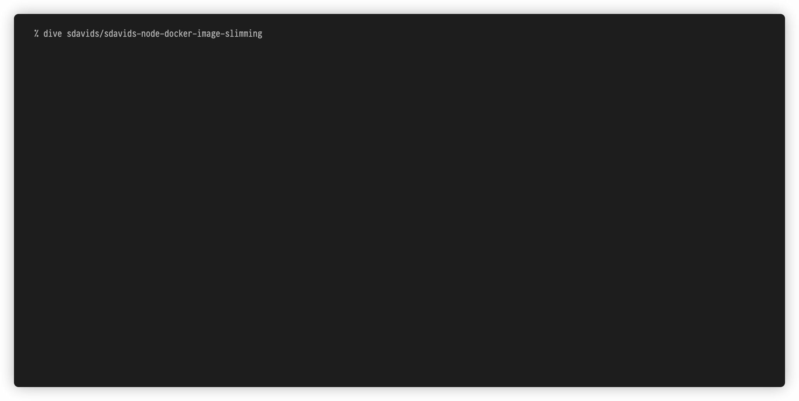

= Node Docker Image Slimming
Sebastian Davids <sdavids@gmx.de>

// Metadata:
:description: node docker image slimming

// Settings:
:sectnums:
:sectanchors:
:sectlinks:
:toc: macro
:hide-uri-scheme:
:source-highlighter: rouge
:rouge-style: github

// Refs:
:uri-contributor-covenant: https://www.contributor-covenant.org
:uri-apache-license: https://www.apache.org/licenses/LICENSE-2.0
:uri-google-style: https://github.com/google/gts
:docker-install-url: https://docs.docker.com/install/
:nvm-install-url: https://github.com/nvm-sh/nvm#installing-and-updating

ifdef::env-browser[:outfilesuffix: .adoc]

ifdef::env-github[]
:outfilesuffix: .adoc
:note-caption: :information_source:
:important-caption: :heavy_exclamation_mark:
:badges:
endif::[]

ifdef::badges[]
image:https://img.shields.io/github/license/sdavids/sdavids-node-docker-image-slimming[Apache License,Version 2.0,link={uri-apache-license}]
image:https://img.shields.io/badge/Contributor%20Covenant-2.1-4baaaa.svg[Contributor Covenant,Version 2.1,link={uri-contributor-covenant}]
image:https://img.shields.io/badge/code%20style-google-blueviolet.svg[Code Style: Google,link={uri-google-style}]
image:https://img.shields.io/osslifecycle/sdavids/sdavids-node-docker-image-slimming[OSS Lifecycle]
image:https://img.shields.io/maintenance/yes/2023[Maintenance]
image:https://img.shields.io/github/last-commit/sdavids/sdavids-node-docker-image-slimming[GitHub last commit]
image:http://isitmaintained.com/badge/resolution/sdavids/sdavids-node-docker-image-slimming.svg[Resolution Time]
image:http://isitmaintained.com/badge/open/sdavids/sdavids-node-docker-image-slimming.svg[Open Issues]
endif::[]

toc::[]

== Results

link:Dockerfile[]

[%header,cols="4,>2,>2,>2"]
|===

|Stage
|Layers
|Size (MB)
|Difference (MB)

|initial
|14
|947.90
|

|https://github.com/sdavids/sdavids-node-docker-image-slimming/commit/d861f69f5df0edc6bef5bfeefdc14dc75d15904a[npm ci --production --no-optional]
|14
|945.60
|-2.30

|https://github.com/sdavids/sdavids-node-docker-image-slimming/commit/64c4d969653429d8de7c53fa9f431e2bb09c3602[node_modules clean script]
|15
|944.90
|-0.70

|https://github.com/sdavids/sdavids-node-docker-image-slimming/commit/5dca92add2b014615ebf69ad8935cb8de2d28d35[node alpine]
|9
|116.10
|-828.80

|https://github.com/sdavids/sdavids-node-docker-image-slimming/commit/448e239d678fb2a454702a6b94d88d9b274c7893[multi-stage build]
|8
|115.50
|-0.60

|https://github.com/sdavids/sdavids-node-docker-image-slimming/commit/55a8ef45ee4f64b15b175883f68a0c946da65149[alpine]
|5
|38.47
|-76.93

|https://github.com/sdavids/sdavids-node-docker-image-slimming/commit/58b7f8d9bda7a27cbfaac416de9e2c369fc2d3d4[upx]
|7
|35.52
|-2.95

|https://github.com/sdavids/sdavids-node-docker-image-slimming/commit/877ee7f4e70a74aa25e3f9741bd7a2884995bf04[webpack]
|6
|35.48
|-0.04

|https://github.com/sdavids/sdavids-node-docker-image-slimming/commit/9b228b4a65bfb81746332967f313ead5ede2d25f[harden]
|6
|35.45
|-0.03

|===

[NOTE]
====
The clean script will have more impact once there are more dependencies.

Webpack will have more impact once there are more source files to bundle.
====

=== Directory Structure

[source,shell]
----
/node  [dr-x node node ]
├──    [-r-- node node ] bundle.cjs
├──    [-r-- node node ] healthcheck.mjs
└──    [dr-x node node ] node_modules
  ├──  [dr-x node node ]   accepts
  │ ├─ [-r-- node node ]     index.js
  │ └─ [-r-- node node ]     package.json
  ├──  [dr-x node node ]   array-flatten
  │ ├─ [-r-- node node ]     array-flatten.js
  │ └─ [-r-- node node ]     package.json
  ├──  [dr-x node node ]   body-parser
  │ ├─ [-r-- node node ]     index.js
  │ ├─ [dr-x node node ]     lib
  │ └─ [-r-- node node ]     package.json
  ...
----

=== Layers

== Development Environment Setup

=== Docker

Install {docker-install-url}[Docker].

=== NVM

Install {nvm-install-url}[NVM].

Afterwards, execute the following in the project root:

[source,shell]
----
$ nvm use
----

=== husky

Create `~/.huskyrc` to ensure Git UI tools can execute `node`:

[source]
----
export NVM_DIR="${HOME}/.nvm"

if [ -f "${NVM_DIR}/nvm.sh" ]; then
  . "${NVM_DIR}/nvm.sh"

  if [ -f ".nvmrc" ]; then
    nvm use
  fi
fi
----

=== API Tools

The usage of the API tools mentioned below is optional.

==== Stoplight Studio

Install https://stoplight.io/studio/[Stoplight Studio].

Add:

* link:api/openapi.yaml[OpenAPI 3 Description]

==== Postman

Install https://www.postman.com/downloads/[Postman].

Import:

* link:api/api.postman_collection.json[Postman Collection]
* link:api/local.postman_environment.json[Postman 'local' Environment]
* link:api/local-secure.postman_environment.json[Postman 'local secure' Environment]

===== FAQ

* https://blog.postman.com/self-signed-ssl-certificate-troubleshooting/[Troubleshooting Self-signed SSL Certificate Issues and More in Postman]

==== RapidAPI

Install https://paw.cloud[RapidAPI].

Open:

* link:api/api.paw[RapidAPI Project]

== Build Tasks

=== Development

==== start

Runs the app from the source files (`src/js/`).

[source,shell]
----
$ npm start
----

=> `http://localhost:3000`

==== start:dev

Runs the app from the source files (`src/js/`); restarting on file changes.

[source,shell]
----
$ npm run start:dev
----

=> `http://localhost:3000`

=== Building

[#build]
==== build

Builds the app.

[source,shell]
----
$ npm run build
----

=> `dist/`

==== start:build

Runs the app generated by <<build>> (`dist/`).

[source,shell]
----
$ npm run start:build
----

=> `http://localhost:3000`

==== clean

Deletes `dist/` generated by <<build>>.

[source,shell]
----
$ npm run clean
----

=== Code Quality

==== lint

Find problems via https://eslint.org[ESLint].

[source,shell]
----
$ npm run eslint
----

==== lint:fix

Fix problems via https://eslint.org[ESLint].

[source,shell]
----
$ npm run eslint:fix
----

=== prettier

Format files with https://prettier.io[prettier].

[source,shell]
----
$ npm run prettier
----

=== Docker

==== docker:build

Builds the app's image.

[source,shell]
----
$ npm run docker:build
----

==== docker:run

Runs the app in a container exposing an HTTP port.

[source,shell]
----
$ npm run docker:run
----

=> `http://localhost:3000`

==== docker:run:secure

Runs the app in a container exposing an HTTPS port.

[source,shell]
----
$ npm run docker:run:secure
----

=> `https://localhost:3000`

[IMPORTANT]
====
You need to create the necessary private key and certificate via
<<cert_self_signed>>.
====

==== docker:sh

Enters a shell into a running app container.

[source,shell]
----
$ npm run docker:sh
----

==== docker:clean

Removes all containers, volumes, and images previously created by this project.

[source,shell]
----
$ npm run docker:clean
----

==== docker:health

Displays the health of the app.

[source,shell]
----
$ npm run docker:health
----

==== docker:inspect

Displays the Docker information of the app's container.

[source,shell]
----
$ npm run docker:inspect
----

==== docker:logs

Displays the logs of the app's container.

[source,shell]
----
$ npm run docker:logs
----

==== docker:rm

Removes the app's container.

[source,shell]
----
$ npm run docker:rm
----

=== Misc

==== clean:node

Deletes `node_modules/` and `package-lock.json`.

[source,shell]
----
$ npm run clean:node
----

[[cert_self_signed]]
==== cert:self-signed

Creates a private key and a self-signed certificate via
https://www.openssl.org/docs/man1.0.2/man1/openssl-req.html[openssl].

[source,shell]
----
$ npm run cert:self-signed
----

=> `docker/app/cert.pem` and `docker/app/key.pem`

[NOTE]
====
The generated certificate is valid for 10 days.
====

===== MacOS

You need to add the created certificate to _Keychain Access_.

Add `docker/app/cert.pem` to your "login" keychain and set
_Secure Sockets Layer (SSL)_ to "Always Trust":

image::src/docs/asciidoc/images/self-signed-macos.png[]

== License

Apache License, Version 2.0 (link:LICENSE[] or {uri-apache-license}).

=== Contribution

See link:CONTRIBUTING{outfilesuffix}[].

== Code of Conduct

We abide by the {uri-contributor-covenant}[Contributor Covenant, Version 2.1]
and ask that you do as well.

For more information, please see link:CODE_OF_CONDUCT{outfilesuffix}[].
