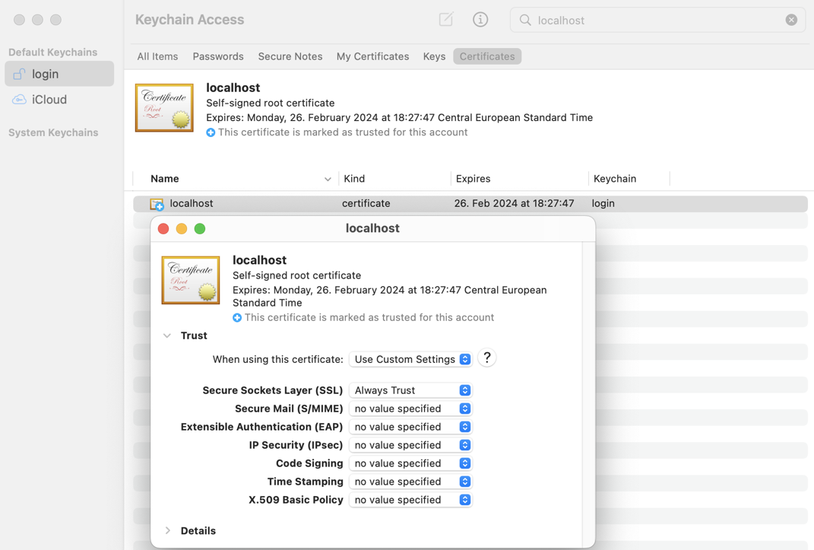

// SPDX-FileCopyrightText: © 2020 Sebastian Davids <sdavids@gmx.de>
// SPDX-License-Identifier: Apache-2.0
= Node Docker Image Slimming
Sebastian Davids <sdavids@gmx.de>
// Metadata:
:description: Techniques for creating a smaller Node.js Docker image.
// Settings:
:sectnums:
:sectanchors:
:sectlinks:
:toc: macro
:toclevels: 3
:toc-placement!:
:hide-uri-scheme:
:source-highlighter: rouge
:rouge-style: github
:experimental:
// Refs:
:uri-contributor-covenant: https://www.contributor-covenant.org
:uri-apache-license: https://www.apache.org/licenses/LICENSE-2.0
:uri-google-style: https://github.com/google/gts
:docker-install-url: https://docs.docker.com/install/
:nvm-install-url: https://github.com/nvm-sh/nvm#installing-and-updating
:fnm-install-url: https://github.com/Schniz/fnm#installation

ifdef::env-browser[:outfilesuffix: .adoc]

ifdef::env-github[]
:outfilesuffix: .adoc
:note-caption: :information_source:
:important-caption: :heavy_exclamation_mark:
:warning-caption: :warning:
:badges:
endif::[]

ifdef::badges[]
image:https://img.shields.io/github/license/sdavids/sdavids-node-docker-image-slimming[Apache License,Version 2.0,link={uri-apache-license}]
image:https://img.shields.io/badge/Contributor%20Covenant-2.1-4baaaa.svg[Contributor Covenant,Version 2.1,link={uri-contributor-covenant}]
image:https://img.shields.io/badge/code%20style-google-blueviolet.svg[Code Style: Google,link={uri-google-style}]
image:https://img.shields.io/osslifecycle/sdavids/sdavids-node-docker-image-slimming[OSS Lifecycle]
image:https://img.shields.io/maintenance/yes/2024[Maintenance]
image:https://img.shields.io/github/last-commit/sdavids/sdavids-node-docker-image-slimming[GitHub last commit]
image:http://isitmaintained.com/badge/resolution/sdavids/sdavids-node-docker-image-slimming.svg[Resolution Time]
image:http://isitmaintained.com/badge/open/sdavids/sdavids-node-docker-image-slimming.svg[Open Issues]
endif::[]

toc::[]

This repository showcases several techniques for creating smaller Node.js Docker images:

. .dockerignore file
. multi-stage build
. smaller base image
. image hardening
. https://upx.github.io[UPX]
. cleaning up `node_modules`
. JavaScript bundling

The link:Dockerfile[example] is an https://expressjs.com[Express]-based REST API packaged in a Docker image with a https://docs.docker.com/reference/dockerfile/#healthcheck[HEALTHCHECK].

****
*TLDR*

1950.0 MB => 93.4 MB (-95.21%)
****

== Techniques

The final result with all techniques applied can be found in the `main` branch:

* link:Dockerfile[]
* link:scripts/docker-build.sh[]

The other branches showcase a single technique--the last commit of the branch contains the changes for the specific technique.

[WARNING]
====
All branches besides `main` will be force-pushed to in order to keep them aligned with the main branch.
====

=== Results

[%header,cols=">1,4,^2m,>2m,>2m,>2m"]
|===

|#
|Branch
| Layer Count
|Image Size (MB)
|node_modules Size (MB)
|server.mjs Size (B)

|0
|https://github.com/sdavids/sdavids-node-docker-image-slimming/tree/000-base?tab=readme-ov-file#node-docker-image-slimming[000-base]
|33
|1950.0
|140.0
|2139

|1
|https://github.com/sdavids/sdavids-node-docker-image-slimming/tree/001-dockerignore?tab=readme-ov-file#node-docker-image-slimming[001-dockerignore]
|35
|1770.0
|120.0
|2139

|2
|https://github.com/sdavids/sdavids-node-docker-image-slimming/tree/002-alpine?tab=readme-ov-file#node-docker-image-slimming[002-alpine]
|31
|382.0
|119.7
|2139

|3
|https://github.com/sdavids/sdavids-node-docker-image-slimming/tree/003-alpine-npm-ci?tab=readme-ov-file#node-docker-image-slimming[003-alpine-npm-ci]
|31
|233.0
|38.3
|2139

|4
|https://github.com/sdavids/sdavids-node-docker-image-slimming/tree/004-alpine-clean-modules?tab=readme-ov-file#node-docker-image-slimming[004-alpine-clean-modules]
|31
|217.0
|22.4
|2139

|5
|https://github.com/sdavids/sdavids-node-docker-image-slimming/tree/005-alpine-multi-stage-build?tab=readme-ov-file#node-docker-image-slimming[005-alpine-multi-stage-build]
|29
|216.0
|22.4
|2139

|6
|https://github.com/sdavids/sdavids-node-docker-image-slimming/tree/006-alpine-alpine-final?tab=readme-ov-file#node-docker-image-slimming[006-alpine-alpine-final]
|24
|116.0
|22.4
|2139

|7
|https://github.com/sdavids/sdavids-node-docker-image-slimming/tree/007-alpine-upx?tab=readme-ov-file#node-docker-image-slimming[007-alpine-upx]
|26
|114.0
|22.4
|2139

|8
|https://github.com/sdavids/sdavids-node-docker-image-slimming/tree/008-alpine-hardening?tab=readme-ov-file#node-docker-image-slimming[008-alpine-hardening]
|30
|114.0
|22.4
|2139

|9
|https://github.com/sdavids/sdavids-node-docker-image-slimming/tree/009-alpine-webpack?tab=readme-ov-file#node-docker-image-slimming[009-alpine-webpack]
|30
|114.0
|22.4
|1189

|9
|https://github.com/sdavids/sdavids-node-docker-image-slimming/tree/009-alpine-esbuild-external?tab=readme-ov-file#node-docker-image-slimming[009-alpine-esbuild-external]
|30
|114.0
|22.4
|1136

|9
|https://github.com/sdavids/sdavids-node-docker-image-slimming/tree/009-alpine-esbuild?tab=readme-ov-file#node-docker-image-slimming[009-alpine-esbuild]
|29
|93.4
|0
|4750597

|===

[start=0]
. baseline with the default variant of the https://hub.docker.com/_/node/[offical NodeJS Docker image] for building the image and serving the example REST API with no optimizations
. use a https://docs.docker.com/reference/dockerfile/#dockerignore-file[.dockerignore file] and specific `COPY` commands
+
[NOTE]
====
The https://github.com/sdavids/sdavids-shell-misc?tab=readme-ov-file#212-ls_extensions[ls_extensions] and https://github.com/sdavids/sdavids-shell-misc?tab=readme-ov-file#ls_extensions_git[ls_extensions_git] functions might help fine-tuning your `.dockerignore` file.
====
. use the `alpine` variant of the https://hub.docker.com/_/node/[offical NodeJS Docker image] for both building and running
. use `npm ci --omit dev --omit optional --omit peer` instead of `npm i`
+
[NOTE]
====
Depending on your project setup you might not be able to omit the https://nodejs.org/en/blog/npm/peer-dependencies[peer dependencies].
====
. use the https://www.npmjs.com/package/clean-modules[clean-modules] npm package to clean up the `node_modules` directory
+
[NOTE]
====
`clean-modules` will have more impact once there are more dependencies.
====
. use a multi-stage build
. use the https://hub.docker.com/_/alpine/[official Alpine Docker image] for serving the example REST API
+
[NOTE]
====
Depending on your project setup you might have to install more packages via `apk add --no-cache`.

The dependencies of `docker run --rm alpine apk add nodejs` might be a starting point.
====
. use https://upx.github.io[UPX] to compress the `node` binary
. harden the final `alpine` image
+
[NOTE]
====
Hardening does not only decrease the image size but also makes it significantly more secure.
====
. bundle the example REST API
+
[NOTE]
====
Bundling will have more impact once there are more source files to bundle.
====
.. use https://webpack.js.org[webpack]
.. use https://esbuild.github.io[esbuild]; `esbuild --bundle --minify --packages=external`
+
[NOTE]
====
Minified JavaScript makes debugging production issues harder.
====
.. use https://esbuild.github.io[esbuild]; `esbuild --bundle --minify`
+
[NOTE]
====
Minified JavaScript makes debugging production issues harder.
====

=== Running the Example

. Build the Docker image:
+
[source,shell]
----
$ npm run docker:build
----

. Start the image (HTTP server):
+
[source,shell]
----
$ npm run docker:start
----
+
=> `http://localhost:3000[http://localhost:3000]`

. Stop the image:
+
[source,shell]
----
$ npm run docker:stop
----

. Create a self-signed certificate:
+
[source,shell]
----
$ npm run cert:create
----

. Start the image (HTTPS server):
+
[source,shell]
----
$ npm run docker:start:secure
----
+
=> `https://localhost:3000[https://localhost:3000]`

There are also <<build-tasks, other build tasks>> available.

=== Example REST API

The example exposes two endpoints (link:api/openapi.yaml[OpenAPI 3 Description]):

`/`::
returns a randomly generated user in JSON format

`/-/health/liveness`::
liveness probe

You can use several <<api-tools>> to interact with the API.

=== More Information

* https://docs.docker.com/reference/dockerfile/#dockerignore-file[.dockerignore file]
* https://docs.docker.com/reference/dockerfile/#copy[Dockerfile - COPY]
* https://hub.docker.com/_/node[node:<version>-alpine]
* https://docs.npmjs.com/cli/v10/commands/npm-ci[npm-ci]
* https://docs.npmjs.com/cli/v10/commands/npm-ci#omit[npm-ci --omit]
* https://docs.npmjs.com/cli/v10/commands/npm-cache[npm-cache]
* https://www.npmjs.com/package/clean-modules[clean-modules]
* https://docs.docker.com/build/building/multi-stage/[Multi-stage builds]
* https://hub.docker.com/_/alpine/[Official Alpine Docker Image]
* https://upx.github.io[UPX]
* https://github.com/ironpeakservices/iron-alpine[iron-alpine]
* https://webpack.js.org[webpack]
* https://esbuild.github.io/getting-started/#bundling-for-node[esbuild - Bundling for node]

== License

Apache License, Version 2.0 (link:LICENSE[] or {uri-apache-license}).

=== Contribution

See link:CONTRIBUTING{outfilesuffix}[].

== Code of Conduct

We abide by the {uri-contributor-covenant}[Contributor Covenant, Version 2.1] and ask that you do as well.

For more information, please see link:CODE_OF_CONDUCT{outfilesuffix}[].

== Development

=== Start Auto-Reloading Dev Server

[source,shell]
----
$ npm run start:dev
----

⇒ http://localhost:3000

== Development Environment Setup

=== Installation

==== Docker

Install {docker-install-url}[Docker].

==== Node Version Manager

Install {fnm-install-url}[fnm] or {nvm-install-url}[NVM].

[NOTE]
====
This repository uses https://typicode.github.io/husky/[husky] for Git hooks.

More information:
https://typicode.github.io/husky/troubleshooting.html#command-not-found[Husky - Command not found]
====

===== fnm

.~/.zprofile
[source,shell]
----
if command -v fnm > /dev/null 2>&1; then
  eval "$(fnm env --use-on-cd)"
fi
----

.~/.config/husky/init.sh
[source,shell]
----
#!/usr/bin/env sh

# vim:ft=zsh

# shellcheck shell=sh disable=SC1091

set -eu

[ -e /etc/zshenv ] && . /etc/zshenv
[ -e "${ZDOTDIR:=${HOME}}/.zshenv" ] && . "${ZDOTDIR:=${HOME}}/.zshenv"
[ -e /etc/zprofile ] && . /etc/zprofile
[ -e "${ZDOTDIR:=${HOME}}/.zprofile" ] && . "${ZDOTDIR:=${HOME}}/.zprofile"
[ -e /etc/zlogin ] && . /etc/zlogin
[ -e "${ZDOTDIR:=${HOME}}/.zlogin" ] && . "${ZDOTDIR:=${HOME}}/.zlogin"
----

===== nvm

.~/.zshrc
[source,shell]
----
export NVM_DIR="${HOME}/.nvm"

[ -s "${NVM_DIR}/nvm.sh" ] && . "${NVM_DIR}/nvm.sh"
[ -s "${NVM_DIR}/bash_completion" ] && . "${NVM_DIR}/bash_completion"

if command -v nvm > /dev/null 2>&1; then
  autoload -U add-zsh-hook
  load-nvmrc() {
    local nvmrc_path="$(nvm_find_nvmrc)"
    if [ -n "${nvmrc_path}" ]; then
      local nvmrc_node_version=$(nvm version "$(cat "${nvmrc_path}")")
      if [ "${nvmrc_node_version}" = "N/A" ]; then
        nvm install
      elif [ "${nvmrc_node_version}" != "$(nvm version)" ]; then
        nvm use
      fi
    elif [ -n "$(PWD=$OLDPWD nvm_find_nvmrc)" ] && [ "$(nvm version)" != "$(nvm version default)" ]; then
      echo 'Reverting to nvm default version'
      nvm use default
    fi
  }

  add-zsh-hook chpwd load-nvmrc
  load-nvmrc
fi
----

.~/.config/husky/init.sh
[source,shell]
----
#!/usr/bin/env sh

# vim:ft=zsh

# shellcheck shell=sh disable=SC1091

set -eu

[ -e /etc/zshenv ] && . /etc/zshenv
[ -e "${ZDOTDIR:=${HOME}}/.zshenv" ] && . "${ZDOTDIR:=${HOME}}/.zshenv"
[ -e /etc/zprofile ] && . /etc/zprofile
[ -e "${ZDOTDIR:=${HOME}}/.zprofile" ] && . "${ZDOTDIR:=${HOME}}/.zprofile"
[ -e /etc/zlogin ] && . /etc/zlogin
[ -e "${ZDOTDIR:=${HOME}}/.zlogin" ] && . "${ZDOTDIR:=${HOME}}/.zlogin"

export NVM_DIR="${HOME}/.nvm"

if [ -f "${NVM_DIR}/nvm.sh" ]; then
  . "${NVM_DIR}/nvm.sh"

  if [ -f '.nvmrc' ]; then
    nvm use
  fi
fi
----

==== shellcheck

===== Linux

[source,shell]
----
$ sudo apt-get install shellcheck
----

===== Mac

[source,shell]
----
$ brew install shellcheck
----

==== yamllint

===== Linux

[source,shell]
----
$ sudo apt-get install yamllint
----

===== Mac

[source,shell]
----
$ brew install yamllint
----

==== hadolint

===== Linux

Install https://github.com/hadolint/hadolint?tab=readme-ov-file#install[hadolint].

===== Mac

[source,shell]
----
$ brew install hadolint
----

[#api-tools]
=== API Tools

==== OpenAPI

Open:

link:api/openapi.yaml[OpenAPI 3 Description]

==== Postman

Install https://www.postman.com/downloads/[Postman].

Import:

* link:api/api.postman_collection.json[Postman Collection]
* link:api/local.postman_environment.json[Postman 'local' Environment]
* link:api/local-secure.postman_environment.json[Postman 'local secure' Environment]

===== More Information

* https://blog.postman.com/self-signed-ssl-certificate-troubleshooting/[Troubleshooting Self-signed SSL Certificate Issues and More in Postman]

==== RapidAPI

Install https://paw.cloud[RapidAPI].

Open:

* link:api/api.paw[RapidAPI Project]

==== JetBrains IDEs

Install and enable the https://plugins.jetbrains.com/plugin/13121-http-client[HTTP Client] plugin.

Open:

* link:api/api.http[HTTP requests file]

use with the `local` or `local-secure` environments defined in:

* link:api/http-client.private.env.json[HTTP environment file]

===== More Information

* https://www.jetbrains.com/help/idea/http-client-in-product-code-editor.html#run_request[Execute HTTP requests]
* https://www.jetbrains.com/help/idea/http-client-in-product-code-editor.html#disable_certificate_verification[Disable certificate verification]

==== Visual Studio Code

Install and enable the https://github.com/Huachao/vscode-restclient[REST Client] extension.

Add the following snippet to `.vscode/settings.json`:

[source,json]
----
    "rest-client.environmentVariables": {
        "local": {
            "host": "http://localhost",
            "port": "3000"
          },
          "local-secure": {
            "host": "https://localhost",
            "port": "3000"
          }
    }
----

Open:

* link:api/api.http[HTTP requests file]

https://github.com/Huachao/vscode-restclient?tab=readme-ov-file#environments[Switch] (kbd:[Ctrl+Alt+E] / macOS: kbd:[⌘ Сmd+⌥ Opt+E]) to the `local` or `local-secure` environment.

===== More Information

* https://github.com/Huachao/vscode-restclient?tab=readme-ov-file#environments[REST Client - Environments]

==== cURL

[source,shell]
----
$ curl http://localhost:3000/
$ curl http://localhost:3000/-/health/liveness
----

[source,shell]
----
$ curl --insecure https://localhost:3000/
$ curl --insecure https://localhost:3000/-/health/liveness
----

===== More Information

* https://github.com/Huachao/vscode-restclient?tab=readme-ov-file#environments[REST Client - Environments]

[#build-tasks]
== Build Tasks

=== Development

==== start

Runs the app from the source files (`src/js/`).

[source,shell]
----
$ npm start
----

=> `http://localhost:3000`

==== start:dev

Runs the app from the source files (`src/js/`); restarting on file changes.

[source,shell]
----
$ npm run start:dev
----

=> `http://localhost:3000`

=== Building

[#build]
==== build

Builds the app.

[source,shell]
----
$ npm run build
----

=> `dist/`

==== start:build

Runs the app generated by <<build>> (`dist/`).

[source,shell]
----
$ npm run start:build
----

=> `http://localhost:3000`

==== clean

Deletes `dist/` generated by <<build>>.

[source,shell]
----
$ npm run clean
----

=== Code Quality

==== format

Format files with https://prettier.io[prettier].

[source,shell]
----
$ npm run format
----

==== format:checks

Checks the formatting of the files with https://prettier.io[prettier].

[source,shell]
----
$ npm run format:check
----

==== lint

Find problems via https://eslint.org[ESLint].

[source,shell]
----
$ npm run lint
----

==== lint:fix

Fix problems via https://eslint.org[ESLint].

[source,shell]
----
$ npm run lint:fix
----

=== Docker

==== docker:build

Builds the app's image.

[source,shell]
----
$ npm run docker:build
----

==== docker:cleanup

Removes all containers, volumes, and images previously created by this project.

[source,shell]
----
$ npm run docker:cleanup
----
==== docker-health

Displays the https://docs.docker.com/reference/dockerfile/#healthcheck[health status] of the app's container.

[source,shell]
----
$ npm run docker:health
----

==== docker-logs

Displays the logs of the app's container.

[source,shell]
----
$ npm run docker:logs
----

==== docker:sh

Opens a shell into the running app's container.

[source,shell]
----
$ npm run docker:sh
----

==== docker:start

Starts the app in a container exposing an HTTP port.

[source,shell]
----
$ npm run docker:start
----

=> `http://localhost:3000[http://localhost:3000]`

==== docker:start:secure

Starts the app in a container exposing an HTTPS port.

[source,shell]
----
$ npm run docker:start:secure
----

=> `https://localhost:3000[https://localhost:3000]`

[IMPORTANT]
====
One needs to create the necessary private key and certificate via <<cert_create>>.
====

==== docker:stop

Stops the app's container.

[source,shell]
----
$ npm run docker:stop
----

=== Misc

==== clean:node

Deletes `node_modules/` and `package-lock.json`.

[source,shell]
----
$ npm run clean:node
----

[[cert_create]]
==== cert:create

Creates a private key and a self-signed certificate.

[source,shell]
----
$ npm run cert:create
----

=> `docker/certs/cert.pem` and `docker/certs/key.pem`

[NOTE]
====
The generated certificate is valid for 30 days.
====

===== MacOS

Check your login keychain in  _Keychain Access_; _Secure Sockets Layer (SSL)_ should be set to "Always Trust":

[NOTE]
====
Chrome and Safari need no further configuration.
====

===== Firefox (MOZILLA_PKIX_ERROR_SELF_SIGNED_CERT)

You need to bypass the https://support.mozilla.org/en-US/kb/error-codes-secure-websites#w_self-signed-certificate[self-signed certificate warning] by clicking on "Advanced" and then "Accept the Risk and Continue":

image::src/docs/asciidoc/images/self-signed-firefox.png[]

===== Related Scripts

. <<cert_delete,cert_delete>>

[#cert_delete]
==== cert:delete

Deletes the private key and the self-signed certificate.

===== Usage

[source,shell]
----
$ npm run cert:delete
----

===== Firefox

You can delete the certificate via `Firefox > Preferences > Privacy & Security > Certificates`; click "View Certificates...":

image::src/docs/asciidoc/images/self-signed-firefox-delete-1.png[]

Click on the "Servers" tab:

image::src/docs/asciidoc/images/self-signed-firefox-delete-2.png[]

===== Related Scripts

. <<cert_create,cert_create>>
